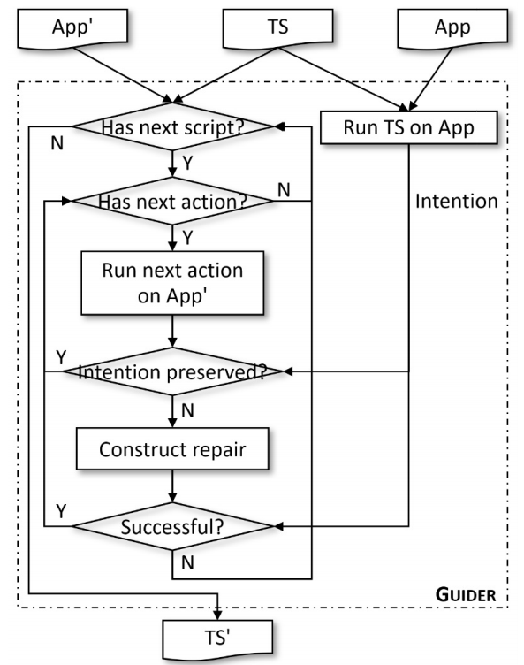

# GUIDER
an automated GUI test script repairs tool for android


I. Requirement
--------------
 - [Appium 1.0.2](https://github.com/appium/appium-desktop/releases/tag/v1.0.2-beta.2)
 - [Android SDK](https://developer.android.com/studio)
 - Android phone or Emulator (Android 7.0 or higher)
 
II. Overview of GUIDER
--------------------




III. Run the Service of Appium
---------------------------
You need just start a service by default in Appium


 IV. Connect Android Phones and the Computer 
 ------------
 1. Just connect your phones via the usb line. You can also start the android emulator if there is no android phone.
 2. In the terminal, execute `adb devices` to make sure the phone is connected.
   
 
 V. Run GUIDER
 ------------
1. Given an app, record the dynamic testing results including imgs and layout files of the based version, with the command `guider -a <App_Name> -c <Script_Name> -r <Root_Path> -o <Based_Version_Path> -n <Updated_Version_Path> -v <Based_Phone_Version> -w <Updated_Phone_Version> -p <App_Package> -t <App_Activity> -l <Repair_Strategy>`
	- Example:  `guider -a 'google driver 1' -c 'google driver 1' -r /Users/nju/Documents/issta-artifact/ -o /Users/nju/Desktop/apk/app-fdroid-debug-old.apk -n /Users/nju/Desktop/apk/app-fdroid-debug-new.apk -v 7.0 -w 10 -p 'com.google.android.apps.docs' -t 'com.google.android.apps.docs.app.NewMainProxyActivity' -l guider`
	- Explaination: The parameter `-a` represents the app is named as `google driver 1`, the parameter `-c` represents the script is named as `google driver 1.py`, the parameter `-v` represents the android version of the phone used to test the based version app (7.0 in this example), the parameter `-w` represents the android version of the phone used to test the updated app (10 in this example), and the parameter `-l` represents the repair strategy to apply (water, meter and guider).
2. For the updated version, repair the broken test action.
	
	Upon the recording process finishes, install the updated version apk in the phone, or just switch to another phone, where the updated version apk has been installed.
	
	After the updated version app has been installed, press the Enter button in the keyboard to start the repair process.
	
	

	
 If it executes failed because of the paths of <Bug_Data_Path> and <defects4j_Home>, please use their absolute paths.
 
 
 V. Structure of the Directories
 -------------------------------
 ```powershell
  |--- README.md               :  readme file
  |--- ApkTestScript           :  test scripts broken in the updated version app
  |--- apk.zip                 :  apk files of both the based and updated versions' apps
  |--- Results                 :  experiment results 
  |--- guider_output           :  output of guider strategy
  |----meter_output            :  output of meter strategy
  |----water_output            :  output of water strategy
  |----main            	       :  executable file 
```

----

__ALL__ suggestions are welcomed.


